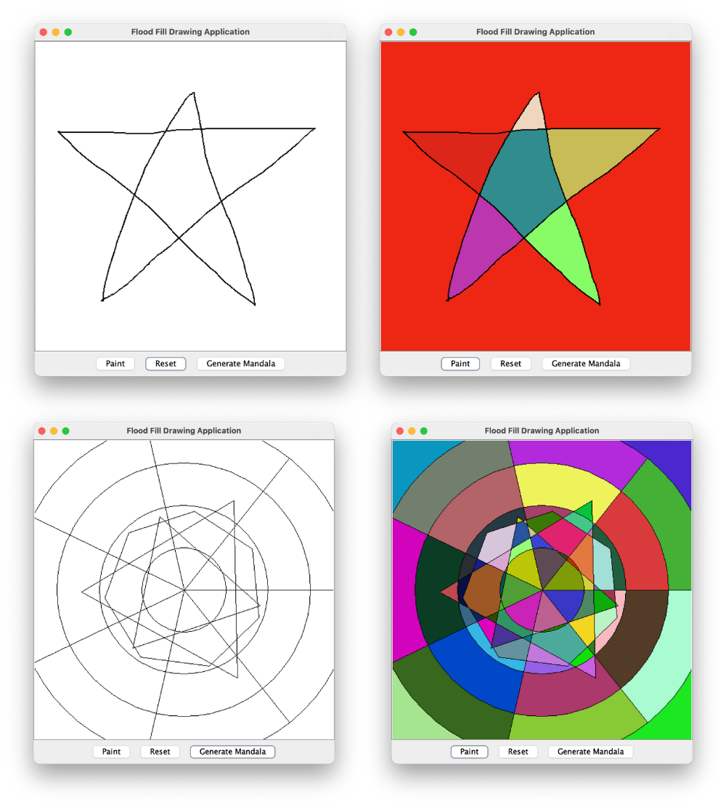

# Flood Fill Algorithm

This project was developed as an assignment for the Foundations of Algorithm Design and Analysis course at PUC Minas by:

- Arthur Ferreira ([@oarthurfc](https://github.com/oarthurfc))
- Fernando Ibrahim ([@FernandoIbrahim](https://github.com/FernandoIbrahim))
- Gabriel Ferreira Amaral ([@Druitti](https://github.com/Druitti))
- Luca Azalim ([@lucaazalim](https://github.com/lucaazalim))
- Pedro Braga ([@bragap](https://github.com/bragap))

---

## Project Description

This project implements the **Flood Fill Algorithm** with both theoretical and practical applications. The implementation includes:

- **Core Algorithm**: An abstract `FloodFill` class that implements an iterative stack-based flood fill algorithm.
- **Interactive GUI**: A drawing application (`DrawingFrame`) where users can draw shapes and apply flood fill to paint enclosed regions, using the `ImageFloodFill` implementation.
- **Simple Mandala Generator**: A `MandalaGenerator` class that creates a simple mandala pattern, so that the user can fill it using the flood fill algorithm.
- **Comprehensive Testing**: Over 19 unit tests covering various edge cases and scenarios.



---

## Problem Introduction

The flood fill algorithm is a fundamental computer graphics and image processing technique used to determine and fill connected regions of similar values in a multi-dimensional array (typically representing pixels in an image).

**The problem can be stated as:**

Given a 2D matrix representing an image, a starting point, and a new color/value, fill all connected cells that have the same original value as the starting point with the new value.

### Applications

- **Paint Bucket Tool**: Fill enclosed areas in image editing software.
- **Game Development**: Flood fill for terrain generation, area detection.
- **Medical Imaging**: Region segmentation and analysis.
- **Geographic Information Systems**: Area calculation and classification.

---

## How the Flood Fill Algorithm Works

This project implements an **iterative stack-based** approach to avoid stack overflow issues commonly associated with recursive implementations.

### Algorithm Overview

1. **Initialization**: Start with a matrix, identify border values, empty values, and the new fill value;
2. **Region Discovery**: Scan the entire matrix to find empty regions (not borders, not already filled);
3. **Iterative Filling**: For each empty region found:
   - Push the starting coordinate onto a stack;
   - While the stack is not empty:
     - Pop a coordinate from the stack;
     - If the coordinate is valid and represents an empty cell:
       - Fill it with the new value;
       - Push all 4 adjacent coordinates (up, down, left, right) onto the stack.

---

## Project Setup and Execution

This project is built using Java and Maven. It includes a GUI for interactive drawing and flood fill operations, as well as unit tests to ensure correctness.

### Prerequisites

- Java 23 or higher
- Maven

### Steps to Run the Project

1. Clone the repository or download the source code.
2. Navigate to the project directory.
3. Build the project using Maven:

   ```text
   mvn clean install
   ```

4. Run the application:

   ```text
   java -cp target/floodfill-1.0-SNAPSHOT.jar br.pucminas.fpaa.floodfill.Main
   ```

### Running Tests

To run the tests:

```text
mvn test
```
